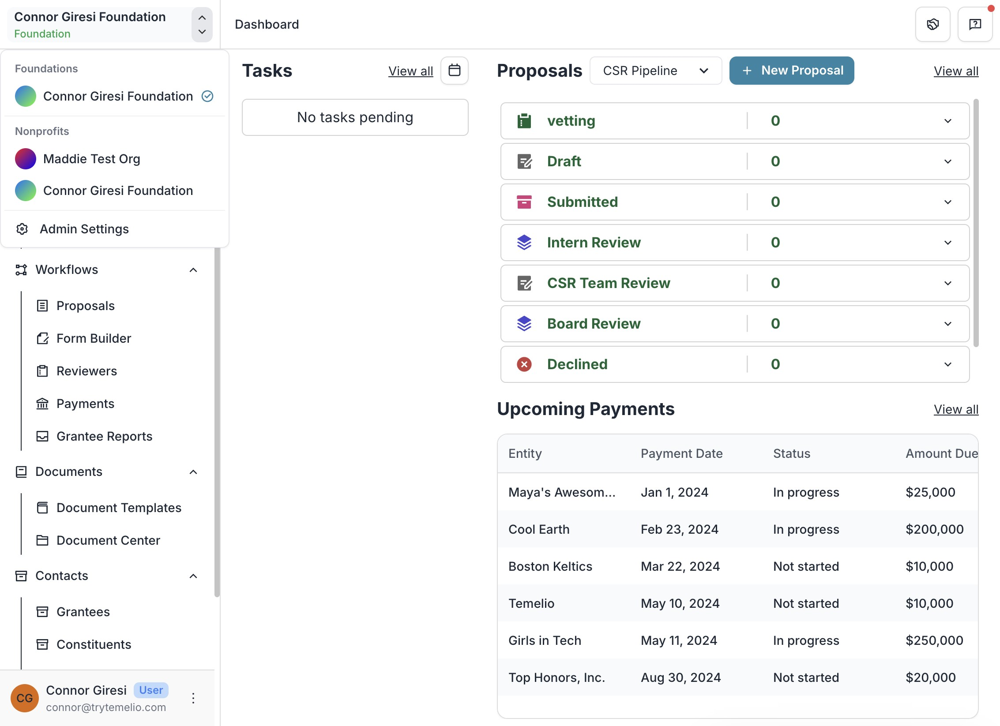
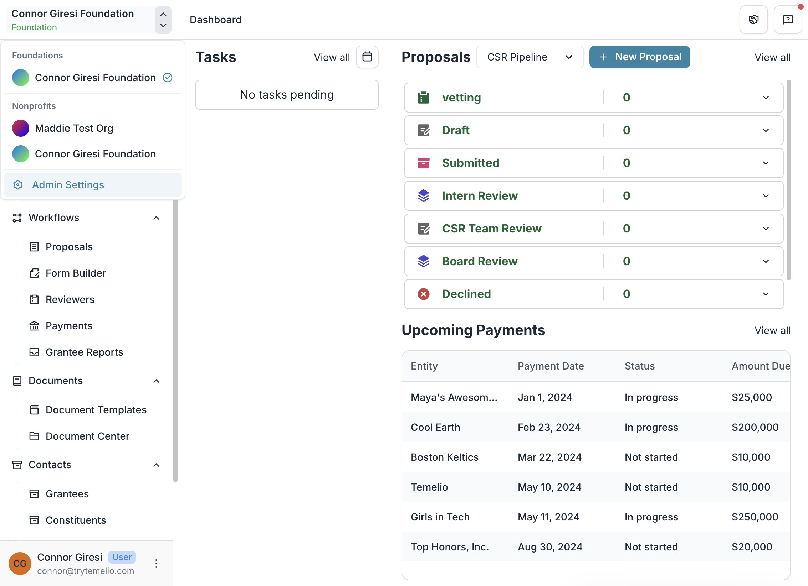
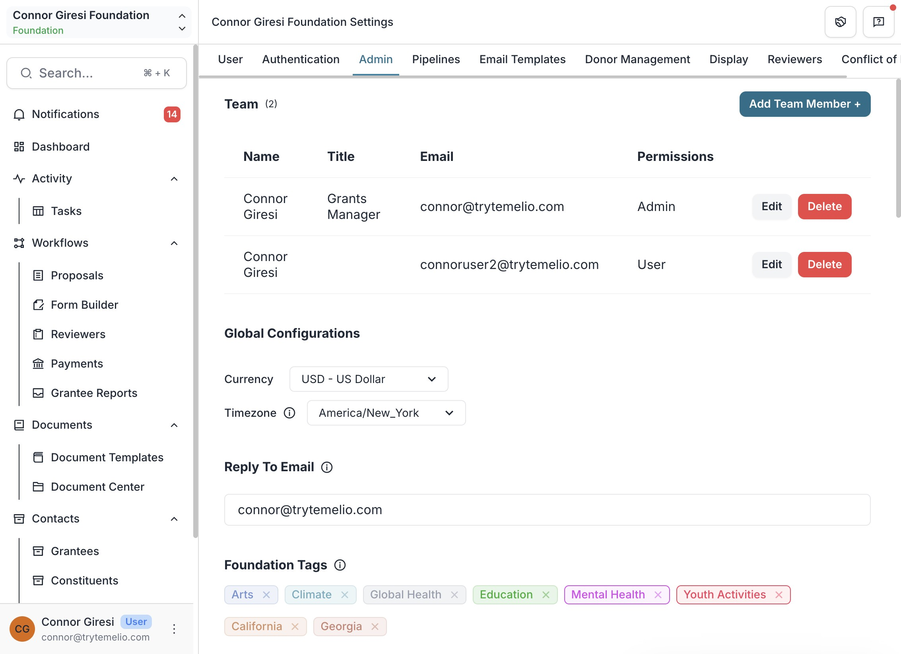
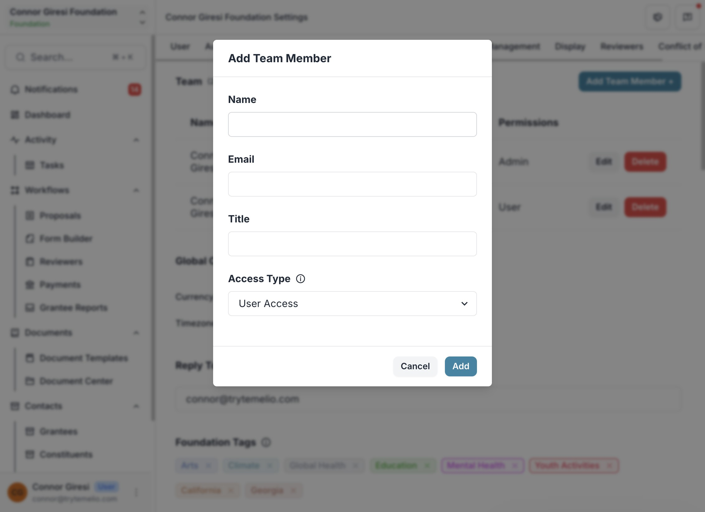
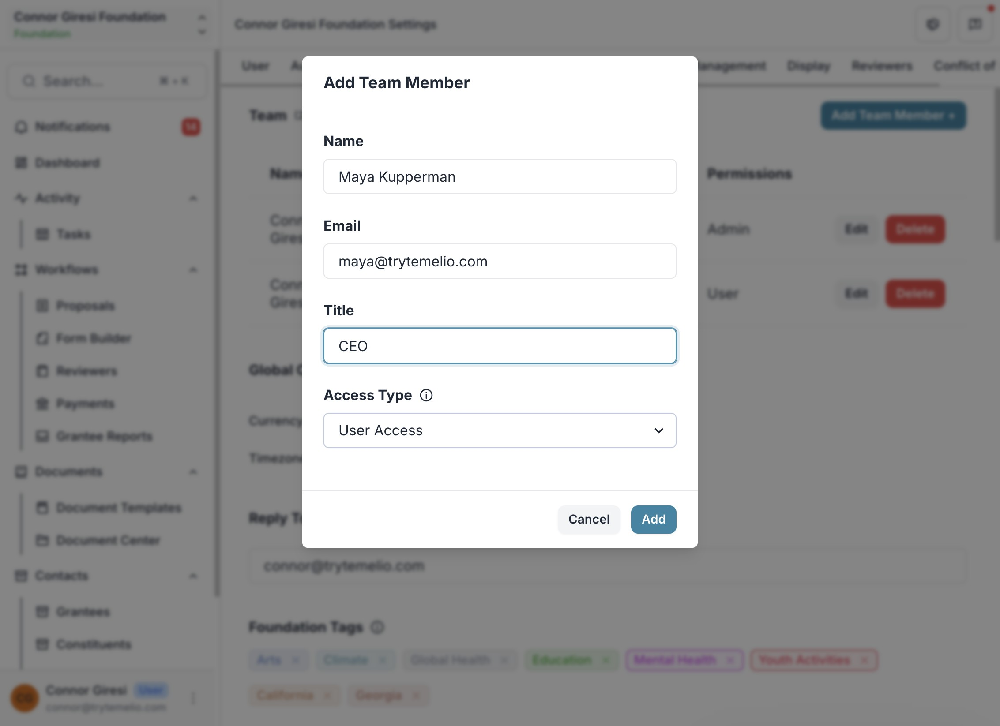
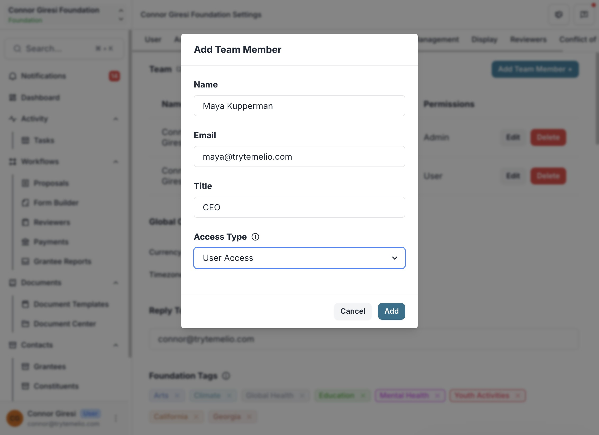

1 - Click the double arrow button on the top left next to the foundation name.

2 - Click "Admin Settings"

3 - Click "Add Team Member" in the top right corner.

4 - Fill out the team member information in the pop up.

5 - Select which type of access this user will need.
Admin Access: Full system access with the ability to edit settings and all other editable fields.
User Access: Can view all information in the system, add comments and internal notes, and take action on tasks and grantees assigned to them.
Payments Access: Includes all User Access permissions, with the added ability to view grantee payment information and edit the payments page.

6 - Click "Add" to add the team member.

