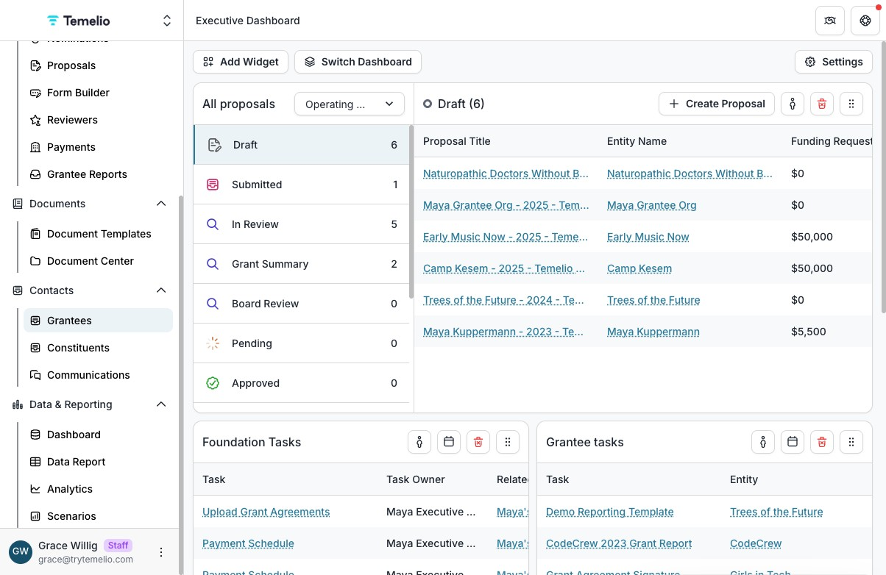
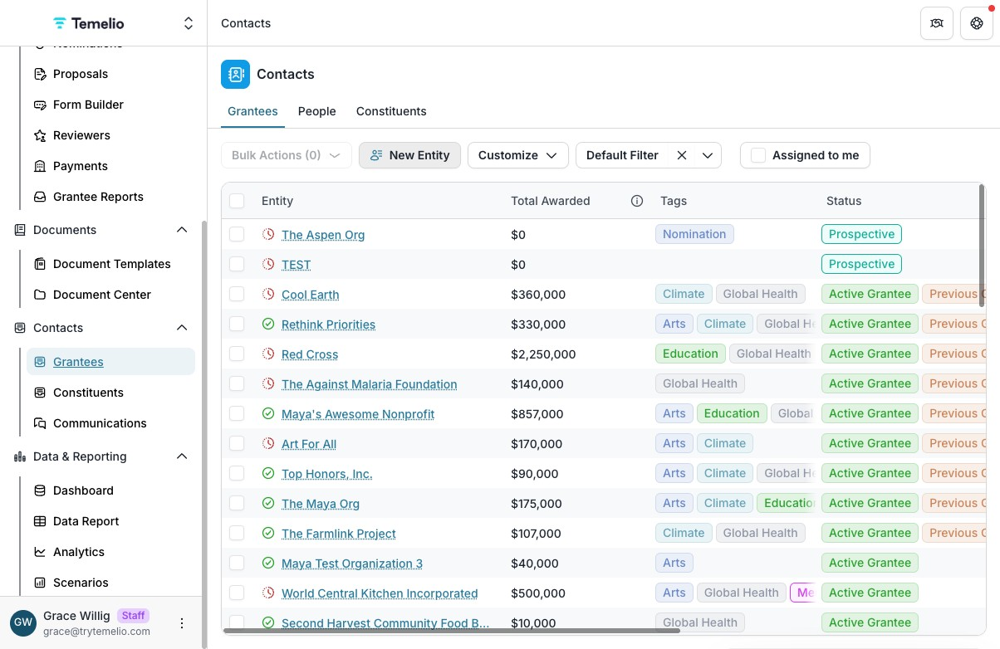
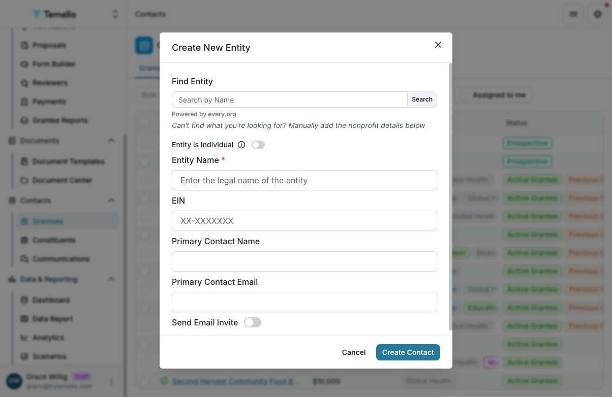
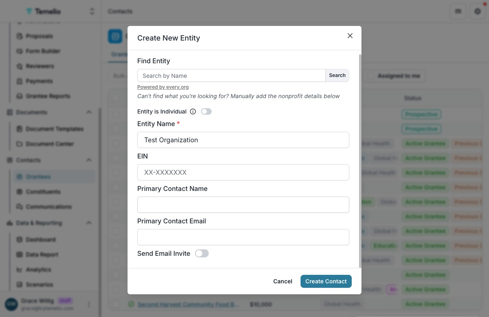
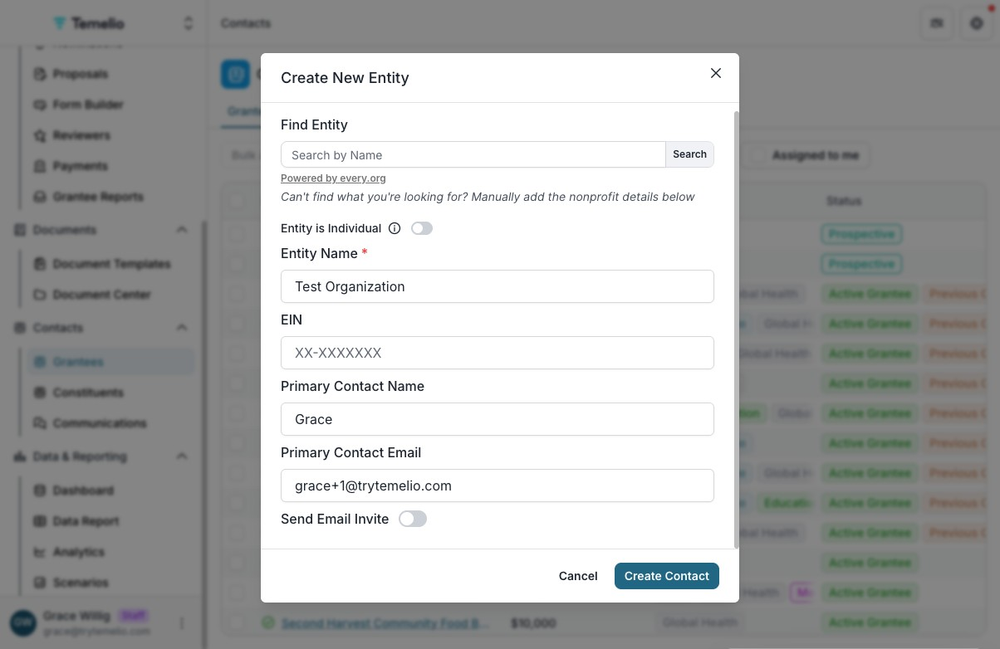
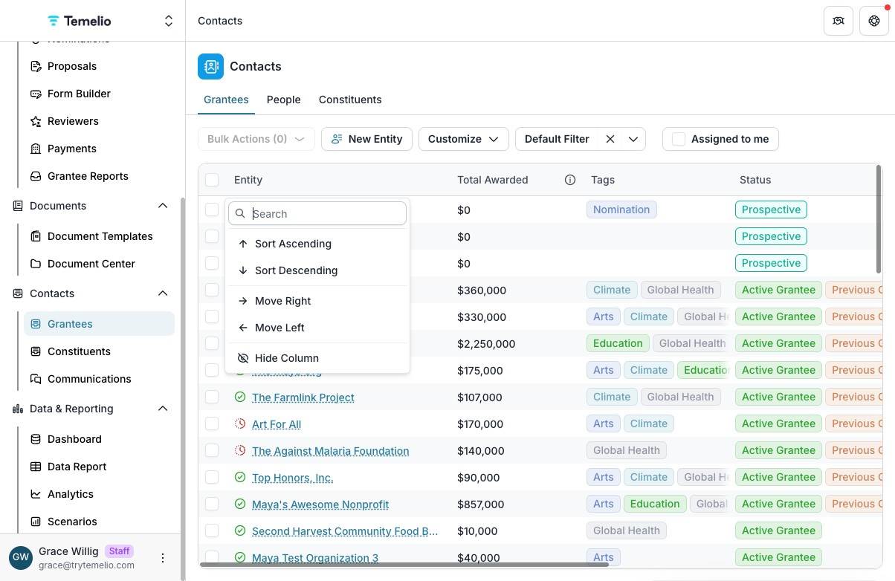
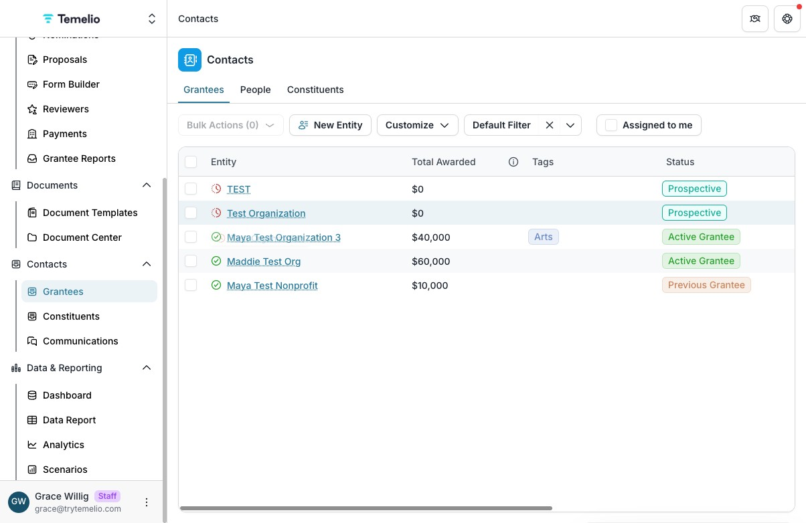
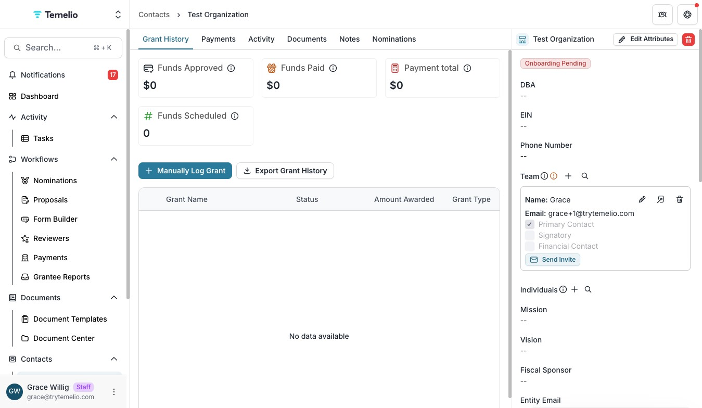

1 - Click "Grantees"

2 - Click "New Entity"

3 - Either search for the organization in the "Find Entity" field, or enter the entity name manually in the "Entity Name" field. (If you search via the "Find Entity" field, the "Organization Name" and "EIN" fields will auto-populate.)

4 - You can also add the name and email of the entity's primary contact, but it is not required. (You can add one, and other team members, later.)

5 - Toggle on the "Send Email Invite" button if you'd like to invite the primary contact (indicated above) to complete the organization profile.

6 - Click "Create Contact"

7 - Now, in the Grantees tab, you can search for/find the newly added organization.

8 - Click on the organization name to see more information.

9 - On the right-hand side of the organization's profile, you can "Edit Attributes" to edit/update information related to this organization. (To add team members, which are organization team members that can access the organization profile, click the "+" symbol next to the Team header.)

